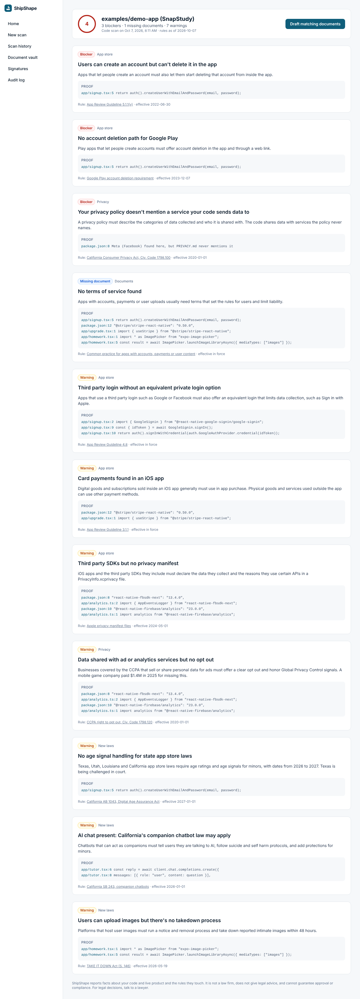

# ShipShape

Connect your code and your live site. ShipShape finds what will get you rejected, sued or fined, writes documents that match what your product actually does, and keeps every scan, document version and signature in one place with a history.

ShipShape reports facts about code and cites the rule. It is not legal advice and never promises approval or compliance.



## Run it

```bash
npm install
npm run seed      # loads a demo app with 11 real findings into the local store
npm run dev       # http://localhost:3000 is the website, /app is the product
```

Other commands:

```bash
npm test                                   # scanner, live check, vault and audit log tests
npm run scan -- examples/demo-app          # scan a folder from the terminal
npm run scan -- https://github.com/owner/repo
npm run scan -- https://yourstore.com
npm run lint                               # typecheck
```

## What's in here

| Path | What it is |
| --- | --- |
| `app/page.tsx` | Marketing website with waitlist |
| `app/privacy`, `app/terms` | ShipShape's own policy and terms (drafts for lawyer review) |
| `app/app/*` | The product: Home, New scan, Scan history, report, Document vault, Signatures, Audit log |
| `app/sign/[id]` | Public signing page (ESIGN and UETA consent, typed name, IP, time, document fingerprint) |
| `app/api/*` | Scan, documents, signatures, waitlist |
| `lib/rules.ts` | The rules database: source, effective date, summary, and the code signals that trigger each rule |
| `lib/scanner/` | Repo scanner, live site checker, shared patterns |
| `lib/docs.ts` | Drafts the privacy policy, terms and store privacy answers from a scan |
| `lib/store.ts` | Local JSON store: scans, versioned documents, signatures, hash chained audit log |
| `supabase/migrations/` | Production Postgres schema with row level security |
| `examples/demo-app` | SnapStudy, a fake app with launch problems on purpose, for demos |

## How it works

1. **Scan.** A public GitHub repo is shallow cloned, scanned and deleted. A live site is loaded like a first time visitor. Private and internal addresses are refused.
2. **Signals.** Patterns turn code and HTML into signals such as `tracker:meta`, `feature:signup` or `secret:aws`, each with file, line and a snippet (secrets masked).
3. **Rules.** Each rule in `lib/rules.ts` tests the signals and returns the evidence that triggers it.
4. **Three way check.** Trackers found in code or on the live site are compared with the privacy policy text, so "your policy never mentions Meta" is a finding.
5. **Vault.** Drafted documents are saved as versions with a SHA-256 fingerprint. A signature is tied to the exact version. Every action lands in an append only audit log where each entry hashes the one before it.

## Before launch

- [ ] A licensed lawyer reviews every rule in `lib/rules.ts` (all are `reviewed: false`), the drafted templates, and `app/terms` and `app/privacy`
- [ ] Accounts and organizations (Supabase Auth), then switch `lib/store.ts` to the Supabase schema
- [ ] GitHub App with read only access for private repos, and a GitHub Action for checks on every pull request
- [ ] Live checks in a real browser (Playwright) to record requests before and after consent, run on a daily schedule
- [ ] Dropbox Sign API for bigger contracts; keep in app signing for simple agreements
- [ ] Rate limits on the scan API, and pin resolved IPs in the live checker to close DNS rebinding
- [ ] Deploy: the website and app to Vercel, scans on a worker that has `git` installed
